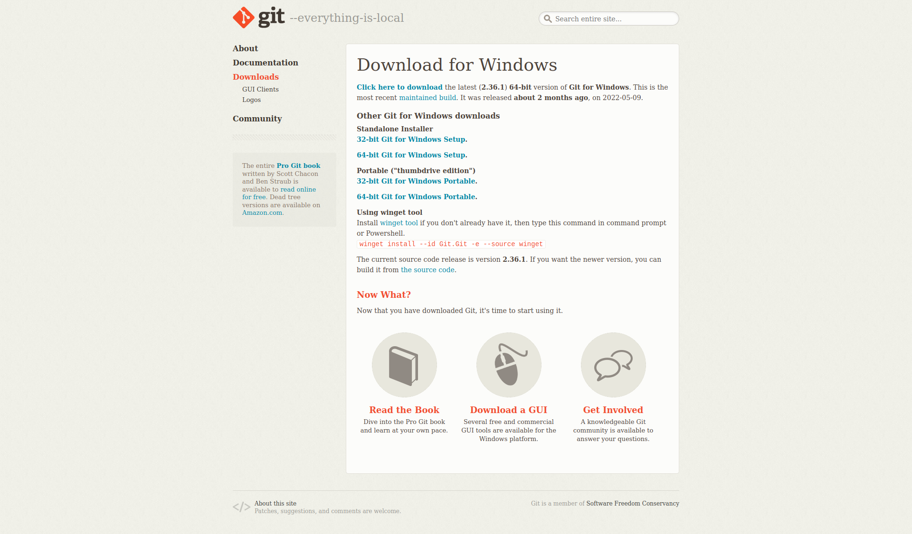
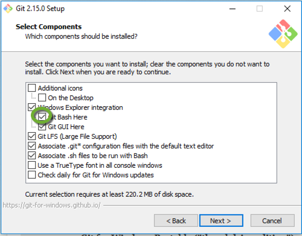
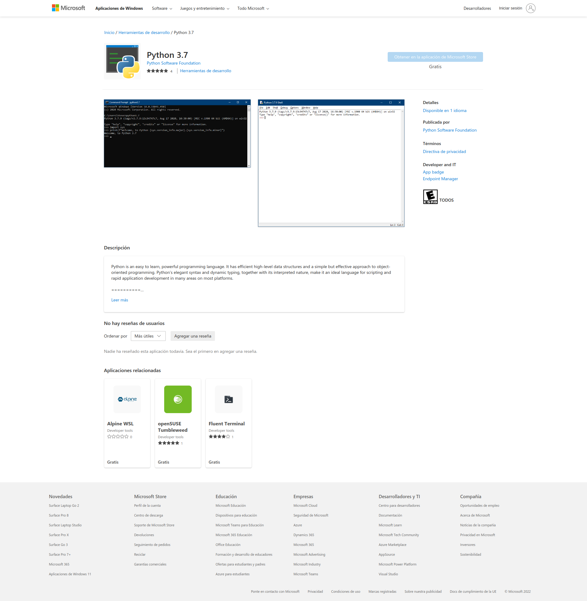
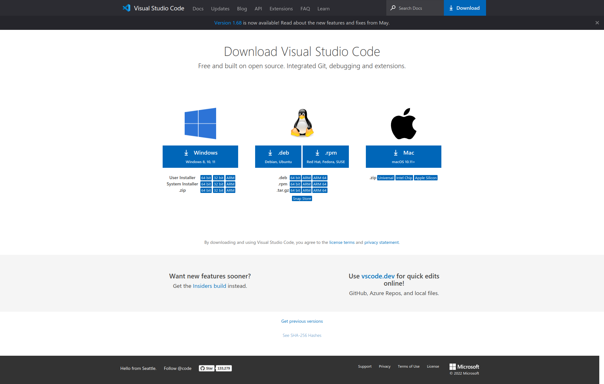

# Desarrollo de Sistemas de Medición Remota

# Setup

## Instalar Git

### Linux
```bash
sudo apt update
sudo apt install git
git --version

git version 2.34.1 # Success!
```

### MacOS
```bash
brew install git
git --version

git version 2.34.1 # Success!
```

### Windows
#### Utilizando Powershell
```powershell
winget install --id Git.Git -e --source winget
```
Descargar desde página oficial: 

https://git-scm.com/download/win



##### Instalar Git bash



##### O utilizar el emulador cmder (full con git)

https://cmder.net/


## Instalar Python

### Linux
```bash
sudo apt update
sudo apt install python python-dev python-pip
python --version

Python 3.10.4 # Success!
```
### MacOS
```bash
brew install python
python --version

Python 3.10.4 # Success!
```

### Windows
Instalar desde Microsoft Store:

https://apps.microsoft.com/store/detail/python-37/9NJ46SX7X90P?hl=es-co&gl=CO



O descargar desde sitio oficial (NO OLVIDAR AGREGAR LA RUTA DE INSTALACIÓN COMO VARIABLE DE ENTORNO):

https://www.python.org/downloads/windows/

Verificar la instalación en Powershell
```bash
python --version

Python 3.10.4 # Success!
```

## Instalación Editor de Código VSCode

#### Descarga desde sitio oficial:

https://code.visualstudio.com/download



## Crear Entorno Virtual en Python

### Entorno Virtual

##### Unix (Linux - MacOS)
```bash
# Instalación
pip install virtualenv

# Crear Entorno
python -m virtualenv <name>

# Activar Entorno
source env/bin/activate

# Desactivar Entorno
deactivate
```
##### Windows
```bash
# Instalación
py -m pip install --user virtualenv

# Crear Entorno
py -m virtualenv <name>

# Activar Entorno
.\env\Scripts\activate

# Desactivar Entorno
deactivate
```

## Descargar Repositorio
```bash
git clone 
```
## Instalar Librerías Necesarias
```bash
pip install -r requirements.txt 
```


