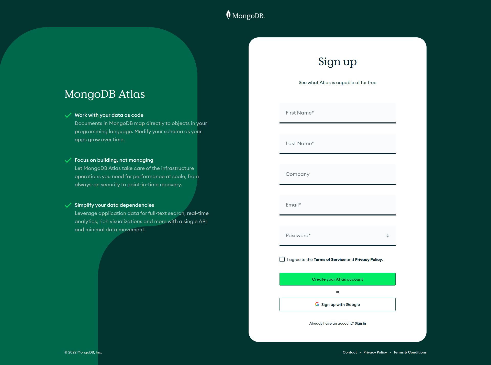
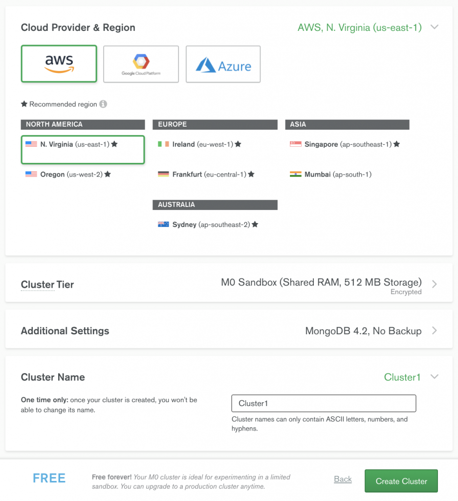
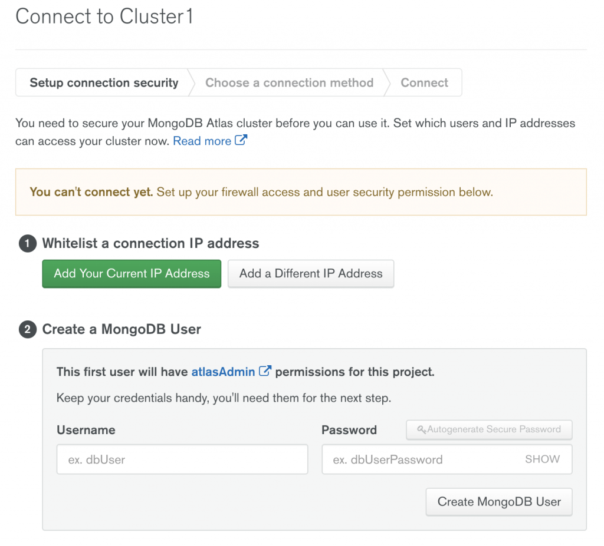
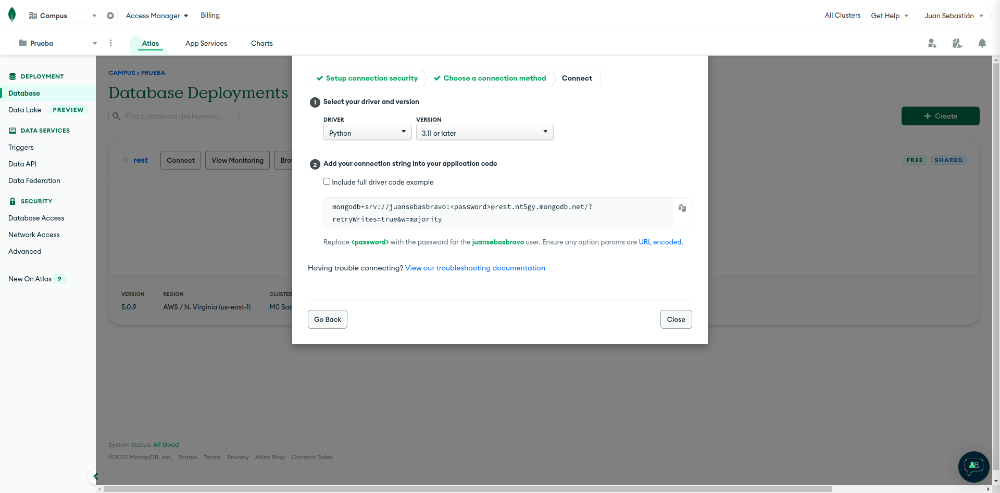

# Base de Datos

## Base de Datos de Tipo Documental 

https://www.ilimit.com/blog/base-de-datos-sql-nosql/

+ Son bases de datos versátiles que permiten agregar información o hacer cambios en el sistema sin necesidad de agregar configuraciones extras. 
+ Las bases de datos NoSQL open source no requieren del pago de licencia y no necesitan un hardware muy potente para poder ser ejecutadas. 
+ Soportan el crecimiento horizontal, es decir, al soportar estructuras distribuidas se pueden instalar nuevos nodos operativos que balancean la carga de trabajo. Es más fácil su expansión debido a este escalado horizontal. 
+ Permiten guardar datos de cualquier tipo, en cualquier momento, sin requerir una verificación. 
+ Realizan consultas utilizando JSON (JavaScript Object Notation, formato sencillo de intercambio de texto). 

## Estructura Base de datos Documental


## Formato JSON
Es un formato de texto pensado en el intercambio de datos, basado en la sintaxis de JavaScript pero es independiente del lenguaje de programación. Fue creado por Douglas Crockford en 2002.

```json
{
    "macAddress": 303E4645,
    "date": 1656385232,
    "payload": {
        "Fase1": {
            "voltage": 120,
            "current": 5,
        },
        "Fase2": {
            "voltage": 120,
            "current": 5,
        },
        "Fase3": {
            "voltage": 120,
            "current": 5,
        }
    }    
}
```
## Utilizando MongoAtlas

### Registro

https://www.mongodb.com/cloud/atlas/register



### Crear Cluster




### Crear Usuario con Credenciales



### Autorizar Direcciones IP de Ingreso


Si se desea conectar desde cualquier IP, se configura la dirección como: 0.0.0.0/0

### Conectar Base de Datos en Aplicación



## Guardar Información en Base de Datos

### Setup cluster de mongo

```python
# Connect to the MongoDB server
db_client = MongoClient(config['MONGO_URI']) 
# Create the database
db_name = db_client['<db_name>']
# Create the collection 
db_collection = db_name['<collection_name>'] 
```

### Recepción de datos y guardar

```python
# On Data Received Callback
def on_message(client, userdata, msg):
    print(msg.topic + " " + str(msg.payload))
    # Convert from json to python
    data = json.loads(msg.payload)
    # Set date if not in data
    if "date" in data:
        data['date'] = datetime.fromtimestamp(data['date'])
    else:
        data['date'] = datetime.now()
    # Save document in collection
    db_collection.insert_one(data)
```
