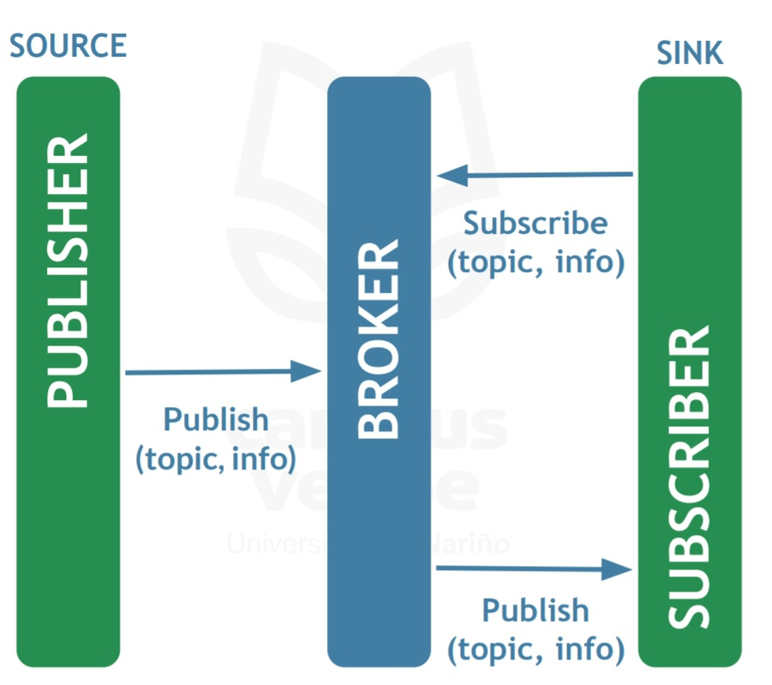
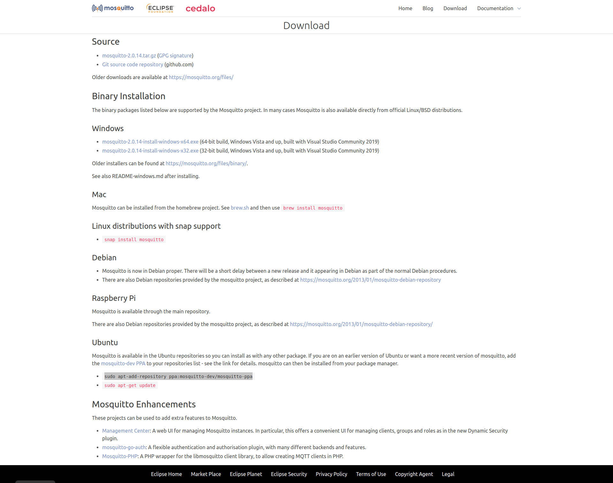

# Protocolo MQTT

## Protocolo MQTT


## Instalación de Broker con Mosquitto

### Linux
```bash
sudo apt-add-repository ppa:mosquitto-dev/mosquitto-ppa
sudo apt update
sudo apt install -y mosquitto mosquitto-clients
sudo systemctl start mosquitto
sudo systemctl status mosquitto

● mosquitto.service - Mosquitto MQTT v3.1/v3.1.1 Broker
     Loaded: loaded (/lib/systemd/system/mosquitto.service; enabled; vendor pr>
     Active: active (running) since Fri 2021-10-08 06:29:25 UTC; 12s ago
       Docs: man:mosquitto.conf(5)
             man:mosquitto(8)
# SUCCESS!

# BROKER SECURITY
sudo mosquitto_passwd -c /etc/mosquitto/passwd <username>

Password:
Reenter password:

# Create file default.conf
sudo nano /etc/mosquitto/conf.d/default.conf
    # Inside the file
    listener 1883
    password_file /etc/mosquitto/passwd
# Ctrl + O to save and Ctrl + X to exit

# Restart Broker
sudo systemctl restart mosquitto
```

### MacOS
```bash
brew install mosquitto
brew services start mosquitto
brew services status mosquitto

● mosquitto.service - Mosquitto MQTT v3.1/v3.1.1 Broker
     Loaded: loaded (/lib/systemd/system/mosquitto.service; enabled; vendor pr>
     Active: active (running) since Fri 2021-10-08 06:29:25 UTC; 12s ago
       Docs: man:mosquitto.conf(5)
             man:mosquitto(8)
# SUCCESS!
```

### Windows

#### Descargar de Página Oficial:

https://mosquitto.org/download/



## Enviar y Recibir Datos a través de MQTT

Para fines praćticos, se puede utilizar brokers de prueba en línea como el de HIVEMQ:

https://www.hivemq.com/public-mqtt-broker/

## Formato JSON
Es un formato de texto pensado en el intercambio de datos, basado en la sintaxis de JavaScript pero es independiente del lenguaje de programación. Fue creado por Douglas Crockford en 2002.

```json
{
    "macAddress": 303E4645,
    "date": 1656385232,
    "payload": {
        "Fase1": {
            "voltage": 120,
            "current": 5,
        },
        "Fase2": {
            "voltage": 120,
            "current": 5,
        },
        "Fase3": {
            "voltage": 120,
            "current": 5,
        }
    }    
}
```

### Crear Cliente MQTT

```python
# Generate a random client ID
client_id = f'python-mqtt-{random.randint(0, 10000)}'
# Create a new MQTT client instance
client = mqtt_client.Client(client_id=client_id)
# Set credentials for connection
client.username_pw_set(
    username = config["USER"],
    password = config["PSSWD"]
)
```

### Enviar Trama de Datos
```python
# Create Data
data = json.dumps({'voltage': 120})
# Start Connection
client.connect(config["HOST"], int(config["PORT"]), keepalive=60)
# Send Data
client.publish('<topic>', data)

time.sleep(5)
client.disconnect()
```

### Recibir Datos
```python
# Receive Data
'''
    DEFINE CALLBACKS TO RECEIVE DATA
'''
# Connection Callback
def on_connect(client, userdata, flags, rc):
    print("Connected with result code " + str(rc))
    client.subscribe("<topic>")
# On Data Received Callback
def on_message(client, userdata, msg):
    print(msg.topic + " " + str(msg.payload))
```